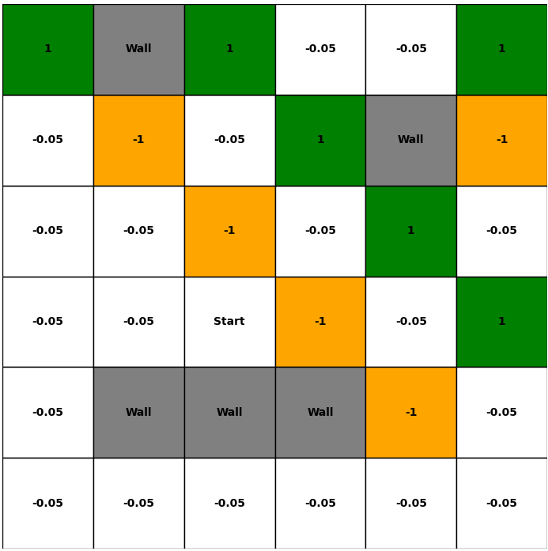
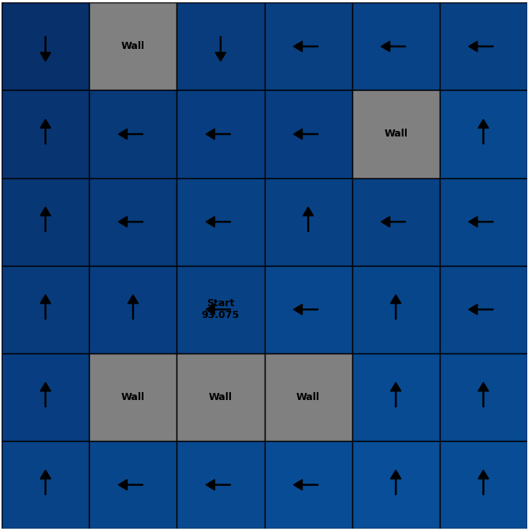
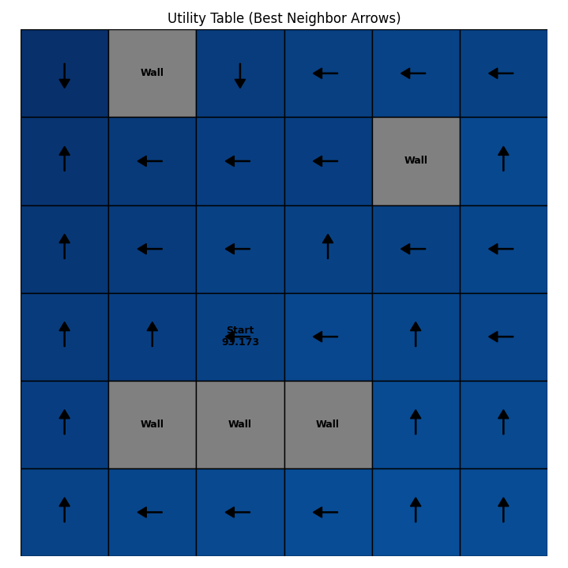
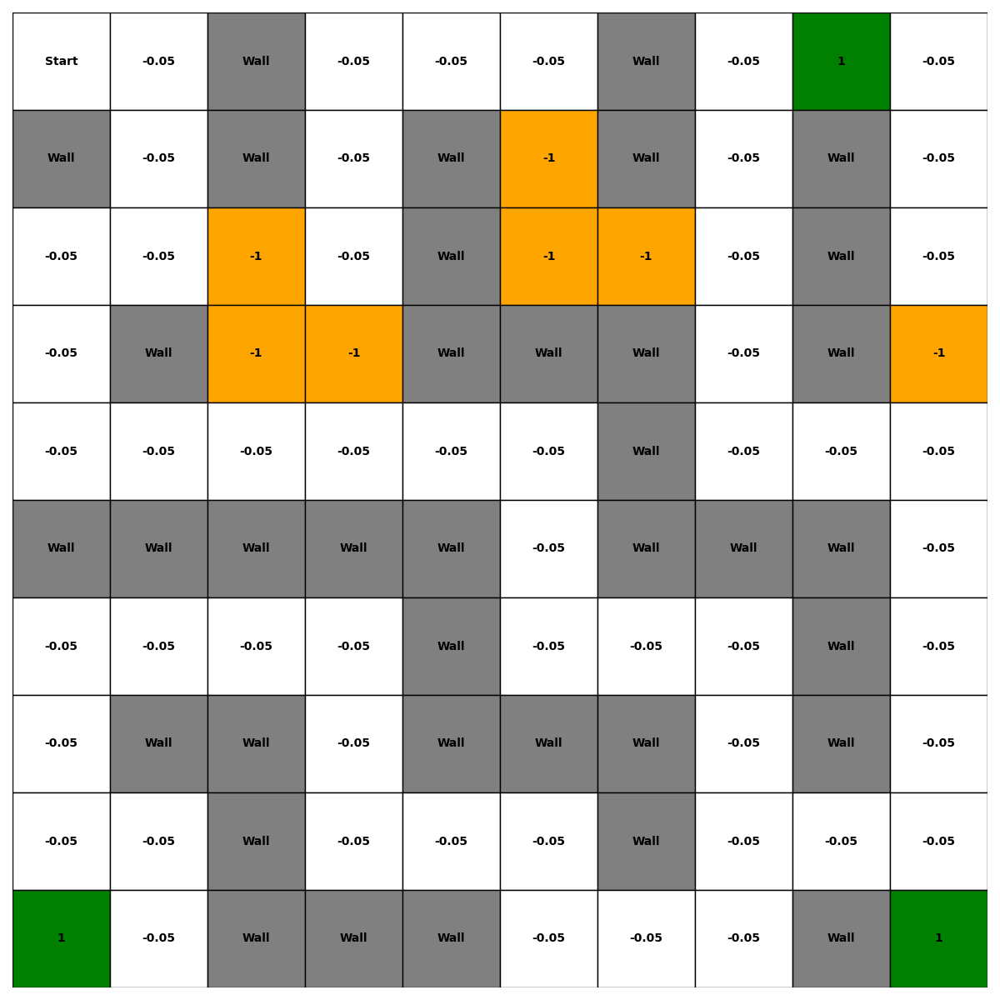

# Maze MDP Solver
### Value Iteration and Policy Iteration in Stochastic Gridworlds

This project implements Value Iteration and Policy Iteration to solve a stochastic maze modeled as a Markov Decision Process (MDP).

Built as part of an Intelligent Agents coursework project, it explores how dynamic programming methods behave under:

- stochastic transitions
- non-terminal reward states
- custom maze design
- scaling to larger environments

The implementation includes full visualisation of:

- reward grids
- optimal policies
- utility tables
- convergence curves over time

---

## Project Highlights

- Implemented Value Iteration from scratch using synchronous Bellman updates
- Implemented Policy Iteration with separate policy evaluation and policy improvement loops
- Designed and tested a custom larger maze with bottlenecks, penalties, and competing reward paths
- Extended experiments to larger environments including 30×30 and 100×100 grids
- Visualised convergence behaviour and compared how environment complexity affects both algorithms

---

## Problem Setting

The maze is treated as a discounted infinite-horizon MDP.

### Rewards
- White cells: `-0.05`
- Green cells: `+1`
- Brown cells: `-1`
- Walls: impassable

### Transition model
For each chosen action:
- intended move occurs with probability `0.8`
- each perpendicular move occurs with probability `0.1`
- if the move hits a wall or boundary, the agent stays in place

### Key assumption
There are no terminal states.

This leads to some interesting long-run behaviour:
- the agent does not stop after reaching reward cells
- utility values can become much larger than immediate rewards
- optimal policies often prefer reward-rich corners, especially where failed moves into walls keep the agent in place

---

## What I Built

### 1. Value Iteration
Implemented Bellman optimality updates of the form:

\[
U_{k+1}(s) = R(s) + \gamma \max_a \sum_{s'} P(s' \mid s,a)U_k(s')
\]

with:
- synchronous utility updates
- convergence thresholding
- policy extraction from final utilities

### 2. Policy Iteration
Implemented the full two-loop process:
- Policy Evaluation: estimate utilities under a fixed policy
- Policy Improvement: greedily update the action at each state

The policy-evaluation update takes the form:

\[
U^\pi(s) = R(s) + \gamma \sum_{s'} P(s' \mid s,\pi(s))U^\pi(s')
\]

This made it possible to compare:
- direct utility convergence
- staged policy refinement
- sensitivity to larger and more complex environments

### 3. Maze Visualisation
Built helper functions to visualise:
- reward layouts
- utility heatmaps
- optimal policy arrows
- utility estimates across iterations

---

## Results

### Original Maze
Both algorithms:
- converged successfully
- produced stable utility values
- found consistent optimal policies

### Custom Maze
I designed a more complex maze with:
- more walls
- bottlenecks
- competing reward regions
- discouraged shortcuts using penalty states

This allowed me to test whether larger and more structured environments change convergence behaviour.

### Larger Grids
I also tested larger environments such as:
- 30×30
- 100×100

Even at much larger scales, the implementation was still able to converge to stable and sensible policies, showing that the approach scales beyond the original coursework example.

---

## Interesting Behaviour Observed

One of the most interesting outcomes was that the learned policy often preferred corner reward regions.

Why?

Because under this transition model:
- moves into walls leave the agent in the same state
- staying near a corner reward can increase long-run expected utility
- with no terminal states, the agent can keep exploiting these regions indefinitely

This creates policies that may loop in high-value areas rather than simply move toward a goal state and stop.

---

## Complexity Insights

The project also explored how environment complexity affects convergence.

### What I found
- Policy Iteration became more expensive as maze complexity increased
- Value Iteration was less visibly affected in some test cases under the chosen stopping rule
- Increasing the number of states did not always increase convergence in a simple linear way
- Reward placement and wall structure were often just as important as grid size

This made the project especially interesting from an algorithmic perspective: the difficulty of an environment was not just about how large it was, but how its structure affected long-run policy decisions.

---

## Repository Structure

```text
IA_ASSIGNMENT1/
├── code/
│   ├── big_grid/
│   │   ├── big_array.py
│   │   ├── policy_iteration_big_grid.py
│   │   └── value_iteration_big_grid.py
│   ├── grid_utils.py
│   ├── policy_iteration.py
│   ├── utility_utils.py
│   ├── value_iteration.py
│   └── visualize.py
├── pictures/
│   ├── figure_1_2_original_maze_reward_grid.png
│   ├── figure_2_1_value_iteration_optimal_policy.png
│   ├── figure_2_2_value_iteration_final_utilities.png
│   ├── figure_2_3_value_iteration_utility_estimates.png
│   ├── figure_3_3_policy_iteration_optimal_policy.png
│   ├── figure_3_4_policy_iteration_final_utilities.png
│   ├── figure_3_5_policy_iteration_utility_estimates.png
│   ├── figure_4_1_custom_maze_reward_array.png
│   ├── figure_4_3_custom_maze_value_iteration_optimal_policy.png
│   ├── figure_4_4_custom_maze_value_iteration_final_utilities.png
│   ├── figure_4_5_custom_maze_value_iteration_utility_estimates.png
│   ├── figure_4_6_custom_maze_policy_iteration_optimal_policy.png
│   ├── figure_4_7_custom_maze_policy_iteration_final_utilities.png
│   └── figure_4_8_custom_maze_policy_iteration_utility_estimates.png
├── Anandharaman_Amudhan_u2322741c.pdf
└── README.md
```

---

## Example Visuals

### Original reward grid


### Value iteration — optimal policy


### Policy iteration — optimal policy


### Custom maze


---

## Running the Project

### Original maze
```bash
python code/value_iteration.py
python code/policy_iteration.py
```

### Larger maze
To switch between the custom 10×10 maze and a larger 100×100 random grid, edit the big-grid scripts and comment/uncomment the relevant line:

```python
rewards = get_random_big_rewards_grid(rows=100, cols=100)
# rewards = get_big_rewards_grid()
```

Use:

- `rewards = get_big_rewards_grid()` for the custom 10×10 maze
- `rewards = get_random_big_rewards_grid(rows=100, cols=100)` for the 100×100 random maze

Then run:

```bash
python code/big_grid/value_iteration_big_grid.py
python code/big_grid/policy_iteration_big_grid.py
```

---

## Full Report

The full write-up is included in:

- `Anandharaman_Amudhan_u2322741c.pdf`

---

## Possible Extensions

Some interesting next steps would be:

- compare against terminal-state versions of the maze
- benchmark runtime as environment size increases
- add support for random maze generation
- compare with reinforcement learning methods such as Q-learning
- visualise policy changes across outer policy-iteration rounds

---

## Reference

[1] S. Russell and P. Norvig, Artificial Intelligence: A Modern Approach, 4th ed. Harlow, England: Pearson, 2021.